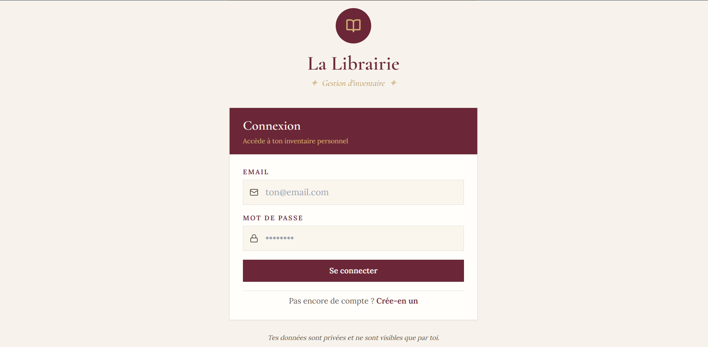
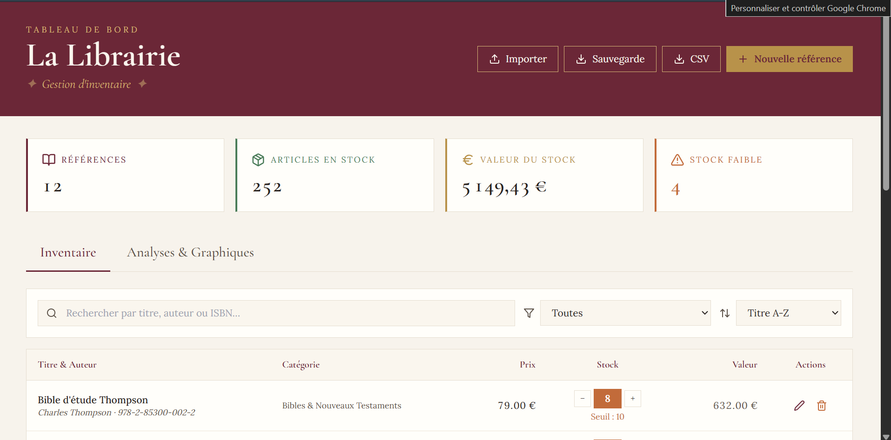
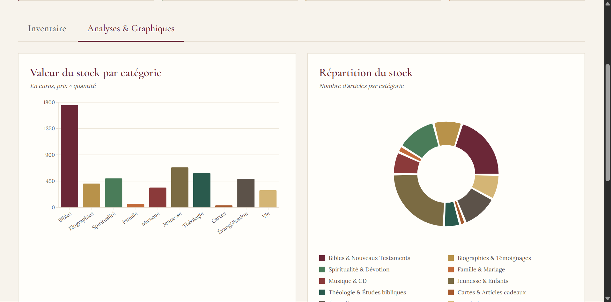

#  La Librairie — Tableau de bord

> Application web de gestion d'inventaire pour librairie chrétienne.
> Multi-utilisateurs, données privées, synchronisation cloud.

**Démo en ligne** : [libracloud.netlify.app](libracloud.netlify.app)








## ✨ Fonctionnalités

- **Authentification sécurisée** — inscription / connexion par email
-  **Inventaire complet** — ajout, modification, suppression de références
-  **Recherche & filtres** — par titre, auteur, ISBN, catégorie
-  **Analyses visuelles** — graphiques par catégorie, valeur du stock
-  **Alertes stock faible** — seuils de réapprovisionnement personnalisés
-  **Synchronisation cloud** — accède à ton inventaire depuis n'importe quel appareil
-  **Données privées** — chaque utilisateur ne voit que ses propres données (Row Level Security)
-  **Import / Export** — JSON pour les sauvegardes, CSV pour Excel

---

## 🛠️ Stack technique

| Couche | Technologie |
|--------|-------------|
| Frontend | React 18 + Vite |
| Styles | Tailwind CSS |
| Graphiques | Recharts |
| Icônes | Lucide React |
| Backend / Auth / DB | Supabase (PostgreSQL) |
| Hébergement | Netlify |

---

## 🚀 Installation locale

### Prérequis

- [Node.js](https://nodejs.org/fr) version 18 ou supérieure
- Un compte [Supabase](https://supabase.com) (gratuit)

### 1. Cloner le projet

```bash
git clone https://github.com/TON-USERNAME/librairie-cloud.git
cd librairie-cloud
```

### 2. Installer les dépendances

```bash
npm install
```

### 3. Configurer Supabase

Crée un projet sur [supabase.com](https://supabase.com), puis exécute ce SQL dans le **SQL Editor** :

```sql
create table public.livres (
  id           uuid primary key default gen_random_uuid(),
  user_id      uuid references auth.users(id) on delete cascade not null,
  titre        text not null,
  auteur       text default '—',
  categorie    text not null,
  prix         numeric(10,2) default 0,
  stock        integer default 0,
  seuil        integer default 5,
  isbn         text default '—',
  created_at   timestamptz default now()
);

create index livres_user_id_idx on public.livres(user_id);

alter table public.livres enable row level security;

create policy "Les utilisateurs voient leurs propres livres"
  on public.livres for select using (auth.uid() = user_id);

create policy "Les utilisateurs créent leurs propres livres"
  on public.livres for insert with check (auth.uid() = user_id);

create policy "Les utilisateurs modifient leurs propres livres"
  on public.livres for update using (auth.uid() = user_id);

create policy "Les utilisateurs suppriment leurs propres livres"
  on public.livres for delete using (auth.uid() = user_id);
```

### 4. Variables d'environnement

Crée un fichier `.env` à la racine (basé sur `.env.example`) :

```env
VITE_SUPABASE_URL=https://ton-projet.supabase.co
VITE_SUPABASE_ANON_KEY=ta-cle-anon-publique
```

Tu trouves ces valeurs dans Supabase → **Project Settings** → **API**.

### 5. Lancer en développement

```bash
npm run dev
```

Ouvre [http://localhost:5173](http://localhost:5173).

---

##  Scripts disponibles

| Commande | Description |
|----------|-------------|
| `npm run dev` | Lance le serveur de développement |
| `npm run build` | Construit la version de production dans `dist/` |
| `npm run preview` | Prévisualise le build de production en local |

---

## Déploiement

### Netlify (recommandé)

1. `npm run build`
2. Va sur [app.netlify.com/drop](https://app.netlify.com/drop)
3. Glisse-dépose le dossier `dist/`
4. Configure les variables d'environnement dans **Site configuration** → **Environment variables**
5. Redéploie

### Déploiement automatique via GitHub

Connecte ton repo GitHub à Netlify pour un déploiement automatique à chaque push.

---

##  Structure du projet

```
librairie-cloud/
├── src/
│   ├── App.jsx           # Routeur Auth/Dashboard
│   ├── Auth.jsx          # Page connexion / inscription
│   ├── Dashboard.jsx     # Dashboard principal
│   ├── supabase.js       # Client Supabase
│   ├── main.jsx          # Point d'entrée
│   └── index.css         # Styles globaux
├── index.html
├── package.json
├── vite.config.js
├── tailwind.config.js
├── postcss.config.js
└── .env.example          # Modèle pour .env
```

---

##  Sécurité

- Le fichier `.env` est dans `.gitignore` et ne doit **jamais** être commité
- La clé `anon` Supabase est publique par design — la sécurité réelle est assurée par la **Row Level Security** (RLS) côté base de données
- En production, activer **Confirm email** dans Supabase → Authentication

---

##  Licence

Projet personnel.

---

##  Crédits

Développé avec pour la gestion d'une librairie chrétienne.
